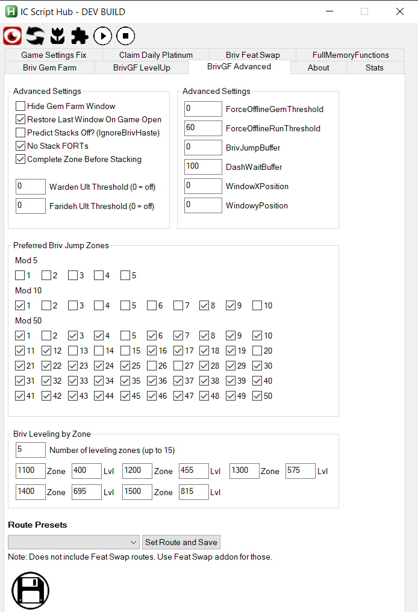

[< Return to Setting Up a Gem Farm](setting-up-a-gem-farm.md)

# Gem Farm: Advanced settings

This iteration of the Gem Farm script attempts to automate a lot of the settings away where possible.

Previously you had to set the specific F keys you wanted the script to hit. It now detects that automatically from the Modron core formation.

The settings file that is saved when you edit the entries using the GUI can be found at [\AddOns\IC_BrivGemFarm_Performance\BrivGemFarmSettings.json](../AddOns/IC_BrivGemFarm_Performance/BrivGemFarmSettings.json)

``NEW`` There is now an advanced settings addon to modify these settings in the GUI. Just enabled BrivGemFarm Advanced Settings.

## "HiddenFarmWindow"

This can be enabled or disabled. When Enabled IC Script Hub will hide the window that appears when you click the Start Gem Farm button on the GUI.

## "RestoreLastWindowOnGameOpen"

This setting will tell the script to try and switch back from the game window to whatever window was open before the game window opened after a stack restart. 

## "IgnoreBrivHaste"
This setting will make the script not take into account any haste settings on Briv when deciding how many stacks to farm. It is shown in the GUI as "Predict Stacks Off? (IgnoreBrivHaste)".

## "ForceOfflineGemThreshold"
The gem farm script is designed to restart the game periodically to build stacks for Briv and keep game performance optimal. This setting enables "hybrid stacking", letting you postpone the offline stack restart until the number of gems earned reaches the threshold configured here (0 = disable).

## "ForceOfflineRunThreshold"
Similar to `ForceOfflineGemThreshold`, but triggers the offline stack restart once every N Modron resets (runs) reaches the set value (0 or 1 = disable). If both run and gem thresholds are set, either reaching its threshold will trigger the stack restart.

## "FortOnlyRestart"
Known in the GUI as "No Stack FORTs". When running Forced Offline restarts, Idle Champions will restart instantly rather than farming stacks while offline.

## "WaitForZoneCompleted"
Known in the GUI as "Complete Zone Before Stacking". When checked, the script completes the current zone before starting online stacking.

## "WardenUltThreshold" / "FaridehUltThreshold"
Use Warden's or Farideh's ultimates while stacking when the number of enemies exceeds this threshold (0 = off).

## "Briv Leveling by Zone"
Allows configuring specific zone levels where Briv should be leveled. You can configure the number of leveling zones (up to 15) and specify the Zone and corresponding Level (Lvl) for each threshold.

## "BrivJumpBuffer"

Occasionally, depending on game build, there can be issues with how the game handles Modron Resets if Briv jumps over the reset zone. This setting is how far before the modron's reset zone Briv will no longer be allowed in the party.

## "DashWaitBuffer"

This is how far before the modron's reset zone the script will no longer attempt to wait for Shandie's Dash to activate. This allows you to effectively disable dash waiting after a stack restart. For more fine tuned control of dash wait, try the ``Shandie Dash Wait after Stacking`` link found on the [Addons page](../Addons.md).

## "WindowXPosition" and "WindowYPosition"

These set the X and Y coordinates for the Gem Farm window. To move the game window try the ``Move Game Window`` addon on the [Addons page](../Addons.md).

## "Preferred Briv Jump Zones"

Each mission cycles through 50 zones. This setting allows you to choose which of those zones you want to use 'q' (checked) formation on and which you want to use 'e' (unchecked) formation on. This allows you to fine tune when Briv jumps. 

Some examples:  
- Disabling all zones ending in 5 or 0 will ensure 4/9j Briv will return to skipping bosses after defeating a boss if they erronously land on one. Do this by clicking on the 5 checkbox in the Mod 5 area.
- Skipping specific zones that have troublesome enemies/bosses (e.g. armored/hit based) can be done by unchecking zones that are at that zone-(jump level + 1). (e.g. to avoid landing on 50 with 7j Briv, you would uncheck 50-(7+1)=42).

** Note: The Route Presets are from an addon created by Emmote.